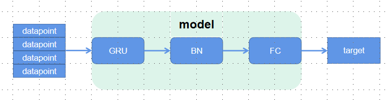

# 使用方法

将feather数据放置在`full_data/1min/`目录下。并且在full_data下创建min_table、min_datapoint、day_table、day_datapoint、adj_table、result_min目录

创建完目录之后运行如下指令进行数据处理：

```
python table_pro.py --adj --min --day
```
该指令将会:
1. 将feather数据转换成csv文件，并且加入复权因子；
2. 将每天的分钟频数据转换成15min频的数据；
3. 将每天的分钟频数据转换成日频的数据；

第一步生成的csv文件放入`full_data/adj_table`目录下。第二步生成的15min频数据放入`full_data/min_table`目录下。第三步生成的日频数据放入`full_data/day_table`目录下。

之后运行如下指令生成对应的15min数据点和日频数据点：
```
python gen_datapoint.py
python gen_daypoint.py
```
通过`gen_datapoint.py`生成的15min数据点放入`full_data/min_datapoint`目录下。通过`gen_daypoint.py`生成的日频数据点放入`full_data/day_datapoint`目录下。

之后运行`main.py`训练15min频的模型，并将结果放入`full_data/result_min`目录下。
```
python main.py --end 2018-12-32
```
参数`--end`指定训练数据的截止时间，默认从`full_data/min_table/`目录下第一个文件开始，并且这之间的数据根据时间的先后按照4：1划分为训练集和验证集。注意这里指定的时间会比正常月份结束的日期多一天，即2018-12-32，以保证包含2018-12-31的数据。

最后使用如下指令在测试集上测试模型:
```
python prediction.py --start 2017-01-01 --end 2017-06-31 --model 2016-12-32 --type 1
```
使用参数`--start`和`--end`指定测试的开始和结束时间，使用参数`model`指定要使用的模型。例如上面使用的模型就是使用2018-12-32这一天之前的所有数据训练的模型。最后的参数type表示使用的模型种类，0代表15min频数据对应的模型；1代表15min频+日频数据对应的模型；2代表分两步训练模型对应的模型。

# 15min数据处理

数据处理主要分为四步：

1. 下载原文件
2. 加入复权因子
3. 数据降频
4. 生成时间序列数据点

下面分别介绍这些步骤

## 1. 下载源文件

首先将1min数据从网络挂在的硬盘上下载下来，地址为：192.168.3.138:\mink\stock\1min。数据为feather文件，包含每个股票每分钟的如下信息：

```python
'code', 'datetime', 'date', 'time', 'open', 'high', 'low', 'close',
'volume', 'amount', 'twap', 'vwap', 'turnnum', 'askvolume', 'bidvolume',
'ask_order_num', 'bid_order_num', 'ask_mean_price', 'bid_mean_price',
'ask_amount', 'bid_amount', 'ask_price1', 'bid_price1', 'ask_volume1',
'bid_volume1', 'ask_volume_pct_1', 'bid_volume_pct_1', 'ask_volume_pct',
'bid_volume_pct', 'ask_amount_pct_1', 'bid_amount_pct_1',
'ask_amount_pct', 'bid_amount_pct', 'mid_price', 'ask_amount_per_order',
'bid_amount_per_order'
```

主要使用的信息为code、datetime、date、time、open、high、low、close、volume、amount。在实际操作的过程中将源文件储存在`./full_data/1min/`目录下。

## 2. 加入复权因子

由于股价收到复权因子的影响，因此需要使用复权因子（adj_factor）乘以股价得到真实的股价。由于源数据中只会用到部分的股票信息，因此在加入复权因子的同时将不需要的信息舍弃，仅保留：code、datetime、open、high、low、close、volume、amount。

加入复权因子的代码实现如下：

```python
def save_adj_table(args):
    api, date, file = args

    new_table = pd.read_feather(file)[
        ['code', 'datetime', 'open', 'high', 
        'low', 'close', 'volume', 'amount']
    ]
    stock_list = list(set(new_table["code"]))
    adjfactor = api.wsd(stock_list, ["adjfactor"], date.strftime('%Y-%m-%d'), date.strftime('%Y-%m-%d'))

    new_table.set_index('code', inplace=True)
    new_table['open'] = new_table['open'] * adjfactor['adjfactor']
    new_table['high'] = new_table['high'] * adjfactor['adjfactor']
    new_table['low'] = new_table['low'] * adjfactor['adjfactor']
    new_table['close'] = new_table['close'] * adjfactor['adjfactor']
    new_table['amount'] = new_table['amount'] * adjfactor['adjfactor']
    new_table.reset_index(inplace=True)
    new_table.to_csv(f"full_data/adj_table/{date.strftime('%Y-%m-%d')}.csv", index=False)
```

具体来说代码使用sqdata中的wsd来获取复权因子adj_factor并且通过pandas的dataframe相乘得到结果。最终将加入复权因子之后的表以csv的形式储存在`./full_data/adj_table/`目录下，并且以`{%Y-%m-%d}.csv`的形式命名。

在加入复权因子时由于从网上请求的数据量很小而且计算量很小（每个数据点只有四次乘法运算），因此处理数据的速度相对较快。

## 3. 数据降频

在拥有每天的分钟频数据之后将数据降频为15min频的数据，并且生成模型需要的6个股票特征，即open、high、low、close、vwap、volume。由于一天有4个小时的交易时间，因此15min频率的数据有16个。降频之后的表格形式如下表示意：

| code | open | high | low | close | vwap | volume |
| --- | --- | --- | --- | --- | --- | --- |
| 000601.SZ | list of 16 | list of 16 | list of 16 | list of 16 | list of 16 | list of 16 |
| 300129.SZ | list of 16 | list of 16 | list of 16 | list of 16 | list of 16 | list of 16 |

得到了每一天每个股票的15min频的数据之后将其命名为`{%Y-%m-%d}.csv`格式保存在`./full_data/min_table/`目录下。

实际降频过程中并行处理的关键步骤如下：

```python
def process_table_all(args):
    date, table = args
    stock_set = set(table["code"])

    open = []
    high = []
    low = []
    close = []
    vwap = []
    volume = []
    stock_list = []
    table_group = table.groupby('code')
    for stock in stock_set:
        result = get_feature_sep(table_group.get_group(stock).reset_index(drop=True), stock)
        if all(element == 0 for element in result[5]):
            continue
        stock_list.append(stock)
        open.append(result[0])
        high.append(result[1])
        low.append(result[2])
        close.append(result[3])
        vwap.append(result[4])
        volume.append(result[5])

    stock_table = pd.DataFrame(list(stock_list), columns=["code"])
    stock_table["open"] = open
    stock_table["high"] = high
    stock_table["low"] = low
    stock_table["close"] = close
    stock_table["vwap"] = vwap
    stock_table["volume"] = volume

    stock_table.to_csv(f"./full_data/min_table/{date.strftime('%Y-%m-%d')}.csv", index=False)
```

可以看到在实际处理的过程中会将每天的股票数据根据个股进行降频处理。对于个股，该函数会调用`get_feature_spe()`函数将数据处理成之前表格中展示的形式，即将open的16个数据降频并且合并在一起。`get_feature_spe()`的实现代码如下：

```python
def get_feature_sep(table, stock):
    stock_df = table
    # stock_df = table[table["code"] == stock].reset_index(drop=True)
    # pd.set_option('display.max_rows', None)
    # pd.set_option('display.max_columns', None)
    # print(stock_df)
    result = [[], [], [], [], [], []]
    for index, row in stock_df[["open","high","low","close","volume","amount"]].iterrows():
        if index % 15 == 0:
            open = row["open"]
            high = row["high"]
            low = row["low"]
            vwap = row["amount"]
            volume = row["volume"]
        else:
            if row["high"] > high: high = row["high"]
            if row["low"] < low: low = row["low"]
            volume += row["volume"]
            vwap += row["amount"]

        if index % 15 == 14: # visit the last line of 15 min
            close = row["close"]
            result[0].append(open)
            result[1].append(high)
            result[2].append(low)
            result[3].append(close)
            if volume == 0:
                result[4].append(open)
                result[5].append(0)
            else:
                result[4].append(vwap / volume)
                result[5].append(volume)

    return result
```

该函数使用的table包含了个股一天的240分钟的信息，根据这240分钟将其0-14划分为一组、15-29划分为一组以此类推划分为16组。最终返回result为6*16的list，包含了需要的6个股票特征。

## 4. 生成时间序列数据点

由于时间序列数据点需要用到之前的20天信息以及之后的5天信息，因此需要预读取前后日期的股票数据。根据过去20天的数据会给每个数据点生成如下所示的特征向量。此外，每个数据点会根据后十天的数据生成标签。最总一天的股票数据点会被保存在如下示意的表格中：

| code | date | target | feature |
| --- | --- | --- | --- |
| 600750.SH | 2020-02-07 | -1.09 | list of 1920 |
| 600416.SH | 2020-02-07 | 4.90 | list of 1920 |

在上表中feature表示特征向量，又6个股票特征构成，每个特征的维度为320。每个股票特征的320维由20天的数据，每天16维拼接而成。

具体生成每天的股票数据点的代码如下：

```python
# generate datapoint using all stock info
def process_datapoint_all(args):
    date_list, table_list, i = args
    stock_set = set(table_list[i]["code"])
    # stock datetime    target  open    high    low close   vwap    volume
    # 1     1           1       320     320     320 320     320     320
    basic_info = []
    target = []
    open = []
    high = []
    low = []
    close = []
    vwap = []
    volume = []

    # print(date_list[i].strftime('%Y-%m-%d'))
    for stock in stock_set:
        # judge if the stock satisfy the requirements
        satisfy = 1
        j = i - 19
        while j <= i + 10:
            if stock not in set(table_list[j]["code"]): satisfy = 0
            j += 1
        if satisfy == 0: continue

        basic_info.append([stock, date_list[i].strftime('%Y-%m-%d')])

        # get target
        today_close = eval(table_list[i][table_list[i]["code"] == stock]["close"].item())[-1]
        future_close = eval(table_list[i + 10][table_list[i + 10]["code"] == stock]["close"].item())[-1]
        target.append([(future_close - today_close) / today_close])

        # get feature
        j = i - 19
        result = [[], [], [], [], [], []]
        while j <= i:
            stock_table = table_list[j][table_list[j]["code"] == stock]
            result[0].extend(eval(stock_table["open"].tolist()[0]))
            result[1].extend(eval(stock_table["high"].tolist()[0]))
            result[2].extend(eval(stock_table["low"].tolist()[0]))
            result[3].extend(eval(stock_table["close"].tolist()[0]))
            result[4].extend(eval(stock_table["vwap"].tolist()[0]))
            tmp_v = eval(stock_table["volume"].tolist()[0])
            result[5].extend([1 if x == 0 else x for x in tmp_v])
            # if all(element == 0 for element in tmp_v):
            #     result[5].extend([1] * len(tmp_v))
            # else: result[5].extend(tmp_v)

            j += 1
        open.append(result[0])
        high.append(result[1])
        low.append(result[2])
        close.append(result[3])
        vwap.append(result[4])
        volume.append(result[5])

    # normalize feature
    volume = time_norm(np.array(volume))
    open = time_norm(np.array(open))
    high = time_norm(np.array(high))
    low = time_norm(np.array(low))
    close = time_norm(np.array(close))
    vwap = time_norm(np.array(vwap))
    basic_info = np.array(basic_info)

    # print(volume)
    # np.savetxt("result_tmp.txt", volume)
    # exit()

    open = zscore_norm(open)
    high = zscore_norm(high)
    low = zscore_norm(low)
    close = zscore_norm(close)
    vwap = zscore_norm(vwap)
    volume = zscore_norm(volume)
    target = zscore_norm(target)

    day_data = np.concatenate([basic_info, target, open, high, low, close, vwap, volume], axis=1)
    np.savetxt(f"./full_data/min_datapoint/{date_list[i].strftime('%Y-%m-%d')}.txt", day_data, fmt="%s")
```

函数process_datapoint_all生成了第i天全部股票的数据点。第i天的全部股票的open、high、low等特征全部放入open、high、low等list中，并且最终转换成numpy.array拼接在一起。声明特征向量等变量之后函数开始对每个股票进行遍历。在遍历个股stock时首先会检测stock在前20天到后10天中是否有停牌、退市等情况，如果出现这种情况则会忽略该股票。如果通过检验则对basic_info和target进行填充，之后访问前20天的数据对feature中的每一个特征进行填充。当全部股票遍历完成之后对特征进行时序归一化和截面归一化。最后将所有的信息拼接在一起然后以`{'%Y-%m-%d'}.txt`格式存入`./full_data/min_datapoint/`目录。

至此，我们得到了可以用于模型训练的数据点。每个数据点包括了其对应的特征向量以及目标的标签，同时还包括一些冗余的信息，例如股票名称和日期。

# 日频数据处理

日频数据处理和之前15min频数据处理的方式几乎相同，同样分为如下的四个步骤

1. 下载原文件
2. 加入复权因子
3. 数据降频
4. 生成时间序列数据点

由于**下载源文件**和**加入复权因子**这两步和之前相同，因此主要展示**数据降频**和**生成时间序列数据点**之间的不同

## 1. 数据降频

每天的数据对于每个股票只需要记录当天的6个特征即可，因根据之前分钟频数据生成日频数据的代码如下。这段代码和之前基本相同，不过多分析。

```python
def process_table_day(args):
    date, table = args
    stock_set = set(table["code"])

    open = []
    high = []
    low = []
    close = []
    vwap = []
    volume = []
    stock_list = []
    table_group = table.groupby('code')
    for stock in stock_set:
        result = get_feature_day(table_group.get_group(stock).reset_index(drop=True), stock)
        # print(result)
        if all(element == 0 for element in result[5]):
            continue

        stock_list.append(stock)
        open.append(result[0])
        high.append(result[1])
        low.append(result[2])
        close.append(result[3])
        vwap.append(result[4])
        volume.append(result[5])

    stock_table = pd.DataFrame(list(stock_list), columns=["code"])
    stock_table["open"] = open
    stock_table["high"] = high
    stock_table["low"] = low
    stock_table["close"] = close
    stock_table["vwap"] = vwap
    stock_table["volume"] = volume

    # print(stock_table)
    # exit()
    stock_table.to_csv(f"./full_data/day_table/{date.strftime('%Y-%m-%d')}.csv", index=False)
    print(date.strftime('%Y-%m-%d'))
```

和之前代码不相同的代码为`get_feature_day`函数，该函数使用pandas自带的函数对整个表格进行搜索生成一天的特征。代码如下。在下列代码中需要注意的点在于，一天交易4个小时也就是240分钟，但是实际上表格中会有241个点。在生成一天的数据时会根据241个点生成数据。此外数据在最后一个点的时候可能会出现close和low为0的情况。在出现这种情况的时候`close`使用倒数第二个close，而low使用倒数第二个low。（实际上这样处理并不一定正确，因为数据可能继续出错，即继续为0，但是目前没有出现这种情况）

```python
def get_feature_day(table, stock):
    # open high low close vwap volume
    result = [[], [], [], [], [], []]
    
    open = table["open"].iloc[0]
    high = table["high"].max()
    low = table["low"].min()
    if low == 0:
        low = table["low"].sort_values().iloc[1]
    close = table["close"].iloc[-1]
    if close == 0:
        close = table["close"].iloc[-2]
    vwap = table["amount"].sum()
    volume = table["volume"].sum()
    result[0].append(open)
    result[1].append(high)
    result[2].append(low)
    result[3].append(close)

    if volume == 0:
        result[4].append(open)
        result[5].append(0)
    else:
        result[4].append(vwap / volume)
        result[5].append(volume)

    return result
```

## 2. 生成时间序列数据点

对于日频数据，在处理过程中将过去40天的日频数据作为特征生成数据点。数据点生成代码如下：

```python
def process_daypoint(args):
    date_list, table_list, i = args
    stock_set = set(table_list[i]["code"])
    # stock datetime    target  open    high    low close   vwap    volume
    # 1     1           1       320     320     320 320     320     320
    basic_info = []
    target = []
    open = []
    high = []
    low = []
    close = []
    vwap = []
    volume = []

    # get the included stock code and group table by code
    j = i - 39
    group_table = []
    while j <= i:
        stock_set = stock_set & set(table_list[j]["code"])
        group_table.append(table_list[j].groupby('code'))
        j += 1
    while j <= i + 10:
        stock_set = stock_set & set(table_list[j]["code"])
        j += 1

    for stock in stock_set:

        basic_info.append([stock, date_list[i].strftime('%Y-%m-%d')])

        # get target
        today_close = eval(table_list[i][table_list[i]["code"] == stock]["close"].item())[-1]
        future_close = eval(table_list[i + 10][table_list[i + 10]["code"] == stock]["close"].item())[-1]
        target.append([(future_close - today_close) / today_close])

        # get feature
        j = i - 39
        result = [[], [], [], [], [], []]
        for iter_table in group_table:
            stock_table = iter_table.get_group(stock).reset_index(drop=True)
            result[0].extend(eval(stock_table["open"].tolist()[0]))
            result[1].extend(eval(stock_table["high"].tolist()[0]))
            result[2].extend(eval(stock_table["low"].tolist()[0]))
            result[3].extend(eval(stock_table["close"].tolist()[0]))
            result[4].extend(eval(stock_table["vwap"].tolist()[0]))
            tmp_v = eval(stock_table["volume"].tolist()[0])
            result[5].extend([1 if x == 0 else x for x in tmp_v])
            j += 1

        open.append(result[0])
        high.append(result[1])
        low.append(result[2])
        close.append(result[3])
        vwap.append(result[4])
        volume.append(result[5])

    # normalize feature
    volume = time_norm(np.array(volume))
    open = time_norm(np.array(open))
    high = time_norm(np.array(high))
    low = time_norm(np.array(low))
    close = time_norm(np.array(close))
    vwap = time_norm(np.array(vwap))
    basic_info = np.array(basic_info)

    # print(volume)
    # print(volume.shape)

    # print(volume)
    # np.savetxt("result_tmp.txt", volume)
    # exit()

    open = zscore_norm(open)
    high = zscore_norm(high)
    low = zscore_norm(low)
    close = zscore_norm(close)
    vwap = zscore_norm(vwap)
    volume = zscore_norm(volume)
    target = zscore_norm(target)

    day_data = np.concatenate([basic_info, target, open, high, low, close, vwap, volume], axis=1)
    np.savetxt(f"./full_data/day_datapoint/{date_list[i].strftime('%Y-%m-%d')}.txt", day_data, fmt="%s")
    print(date_list[i].strftime('%Y-%m-%d'))
```

由于要对于当天每一个stock生成数据点时都需要确定过去40天和未来10天是否有数据点，单独处理每一个stock的时候访问效率过低，因此在实际生成过程中首先访问附近50天，确定需要共同拥有的stock集合，然后再这个集合的基础上对每一个stock进行生成。

其他处理方式和15min频数据类似，不赘述。

在股票筛选方面有如下的问题。这两个加入在生成数据点的时候即可。

1. 剔除st或者带*的股票、次新股；
2. 剔除过去20日成交额均值低于3kw的股票；

收益率和训练数据要有很大的修改。

以周为单位对数据进行处理将周排列为$W_0, W_1, W_2, \cdots$。训练数据为$W_0$最后一个交易日的对应的数据点，包括该点往前40天。target由$W_1$的开盘价和$W_2$的开盘价组成。

训练数据的选择可以在模型训练的时候再说，这个不着急

# 模型和训练

## 1. 模型

### 1.1 15min频模型

模型根据研报中给出的模型进行训练和搭建。模型的主要模块如下



模型对应的实现代码如下：

```python
class GRUModel(nn.Module):
    def __init__(self, input_size, hidden_size, output_size, num_layers=1):
        super(GRUModel, self).__init__()
        self.gru = nn.GRU(input_size=input_size, hidden_size=hidden_size, num_layers=num_layers)
        self.bn = nn.BatchNorm1d(hidden_size)
        self.fc = nn.Linear(hidden_size, output_size)

    def forward(self, x):
        output, _ = self.gru(x)
        output = self.bn(output)
        output = self.fc(output)
        return output
```

### 1.2 15min+日频模型

使用日频数据和15min频数据放入模型进行训练然后将得到的隐藏层拼接，最后使用FC层得到结果。整个模型的结构如下：


实现模型的代码如下：

```python
class ReturnModel(nn.Module):
    def __init__(self, input_size1, input_size2, hidden_size, output_size):
        super().__init__()
        
        self.gru1 = nn.GRU(input_size=input_size1, hidden_size=hidden_size, num_layers=1, batch_first=True)
        self.bn1 = nn.BatchNorm1d(hidden_size)
        
        self.gru2 = nn.GRU(input_size=input_size2, hidden_size=hidden_size, num_layers=1, batch_first=True)
        self.bn2 = nn.BatchNorm1d(hidden_size)
        
        self.concat = nn.Linear(2*hidden_size, 2*hidden_size)
        
        self.fc = nn.Linear(2*hidden_size, output_size)

    def forward(self, x1, x2):
        out1, _ = self.gru1(x1) 
        out1 = self.bn1(out1[:, -1, :])
        
        out2, _ = self.gru2(x2)
        out2 = self.bn2(out2[:, -1, :])
        
        out = torch.cat([out1, out2], dim=1)
        out = self.concat(out)
        out = self.fc(out)
        return out
```

在这次的模型实现中，将之前的GRU做出了一定的调整，将不同feature分开作为时间序列特征放入GRU模块中。放弃了之前将特征根据行优先展开的方式。

### 1.3 **基于参数冻结+残差预测的增量学习模型**

该模型仅实现，在本地机器上运行，还没有在服务器上运行。模型结构如下。在实现的过程中只需要将两个1.1节的模型拼接起来即可。


## 2. 训练参数

在实际训练过程中可以调整的参数有很多，但是为了尽量和研报中的参数保持一致，因此选择如下的参数进行训练：

```python
input_size = 1920
hidden_size = 30
output_size = 1
learning_rate = 0.0001
num_epochs = 50
batch_size = 1024
```

确定了训练参数之后来说明具体训练如何使用数据。由于数据是从2016年1月1日开始统计的，每个交易日会产生对应的数据。在训练过程中交易日要间隔五日。即通过如下方式将数据导入训练集：

```python
for i in range (len(file_list_init)):
    if i % 5 == 0 and file_list_init[i][-14:] <= test_end:
        file_list.append(file_list_init[i])
```

由于需要将训练数据和验证数据按照4：1的方式进行划分，因此在完成数据间隔五日选择后将数据使用如下代码进行4：1划分：

```python
train_len = int(len(file_list) * 4 / 5)
train_list = file_list[:train_len]
test_list = file_list[train_len:]
```

之后就可以根据划分好的数据行训练和验证。

全部的训练数据从2016-2023年，回测的时间段为2017-2023年。在第一次训练的过程中使用2016-01-01到2016-12-31的数据作为训练集和验证集，对2017-01-01到2017-06-30的数据进行回测。第二次训练的过程使用2016-01-01到2017-06-30的数据作为训练集和验证集，对2017-07-01到2017-12-31的数据进行回测。一次类推一直将所有的数据回测完。

## 3. 损失函数

在研报中给出的损失函数为IC的相反数，因此使用如下的公式计算IC，并且将其相反数作为损失函数：

$$
IC = \frac{cov(\hat{y}, y}{\sigma(\hat{y}) \sigma(y)}
$$

损失函数的代码实现如下：

```python
def loss_fn(y_pred, y_true):
    y = torch.cat((y_pred.view(1, -1), y_true.view(1, -1)), dim=0)
    corr = torch.corrcoef(y)[0, 1]
    return -corr
```

# 结果

## 1. 使用15min频数据训练模型结果

损失函数结果如下：

| 日期 | train | Validaton | 日期 |  |
| --- | --- | --- | --- | --- |
| 2016.1-2016.12 |  |  | 2017.1-2017.6 |  |
| 2016.1-2017.6 |  |  | 2017.7-2017.12 | -0.0454 |
| 2016.1-2017.12 |  |  | 2018.1-2018.6 | -0.0650 |
| 2016.1-2018.6 |  |  | 2018.7-2018.12 | -0.0701 |
| 2016.1-2018.12 |  |  | 2019.1-2019.6 | -0.0876 |
| 2016.1-2019.6 |  |  | 2019.6-2019.12 | -0.0395 |
| 2016.1-2019.12 |  |  | 2020.1-2020.6 | -0.0611 |
| 2016.1-2020.6 |  |  | 2020.7-2020.12 | -0.0421 |
| 2016.1-2020.12 |  |  | 2021.1-2021.6 | -0.0378 |
| 2016.1-2021.6 | -0.205 | -0.044299 | 2021.7-2021.12 | -0.0191 |
| 2016.1-2021.12 | -0.1941807 | -0.03338 | 2022.1-2022.6 | -0.0592 |
| 2016.1-2022.6 | -0.19182336 | -0.0428290 | 2022.7-2022.12 | -0.0418 |
| 2016.1-2022.12 | -0.18523 | -0.0442 | 2023.1-2023.6 | -0.0299 |
| 2016.1-2023.6 | 0.18027742997432086 | 0.04567601531744003 | - |  |

回测效果图如下：

## 2. 使用日频+15min频数据训练模型结果：

| 日期 | train | Validaton | 日期 |  |
| --- | --- | --- | --- | --- |
| 2016.1-2016.12 | 0.12063454960783322 | 0.05148568004369736 | 2017.1-2017.6 |  |
| 2016.1-2017.6 | 0.10251909085254893 | 0.07813182473182678 | 2017.7-2017.12 |  |
| 2016.1-2017.12 | 0.11535687849460961 | 0.10477843880653381 | 2018.1-2018.6 |  |
| 2016.1-2018.6 | 0.11470600897975436 | 0.10252845287322998 | 2018.7-2018.12 |  |
| 2016.1-2018.12 | 0.11519967918435535 | 0.09491878002882004 | 2019.1-2019.6 |  |
| 2016.1-2019.6 | 0.11607920024376195 | 0.10481078922748566 | 2019.6-2019.12 |  |
| 2016.1-2019.12 | -0.11816911378565705 | -0.08947926014661789 | 2020.1-2020.6 |  |
| 2016.1-2020.6 | 0.11753023512657435 | -0.08486122637987137 | 2020.7-2020.12 |  |
| 2016.1-2020.12 |  |  | 2021.1-2021.6 |  |
| 2016.1-2021.6 |  |  | 2021.7-2021.12 |  |
| 2016.1-2021.12 |  |  | 2022.1-2022.6 |  |
| 2016.1-2022.6 |  |  | 2022.7-2022.12 |  |
| 2016.1-2022.12 |  |  | 2023.1-2023.6 |  |
| 2016.1-2023.6 |  |  | - |  |

# 问题

目前自己训练的模型结果和研报上的结果不是非常符合，在全A股上我的模型IC均值只有0.04左右，但是研报的rank IC均值有0.09。

此外使用多频混合模型研报的rank IC均值在0.08左右，我的IC均值在0.08以上。

基于参数冻结+残差预测的增量学习模型目前还没有在服务器上运行，因此不知道结果。
